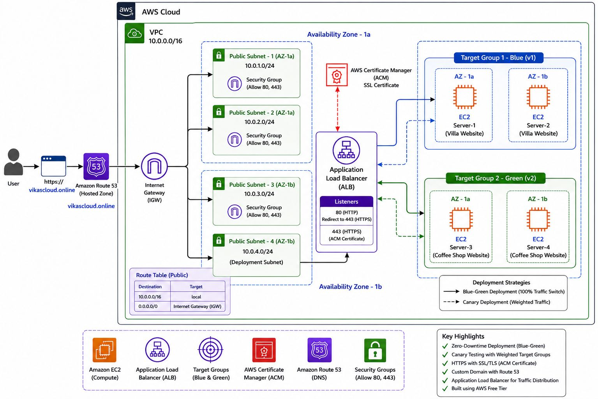

# AWS Blue-Green and Canary Deployment

A production-style AWS deployment project demonstrating highly available web applications using Amazon EC2, Application Load Balancer, Target Groups, Route 53, AWS Certificate Manager, HTTPS, health checks, Blue-Green deployment, Canary deployment, traffic shifting, rollback, and failure testing.

---

## Project Overview

This project demonstrates how two application environments can be deployed on AWS and exposed through a single domain using an Application Load Balancer.

The project contains two environments:

| Environment | Servers | Application | Target Group |
|---|---|---|---|
| Blue | Server 1, Server 2 | Villa Agency Website | `Blue-TG` |
| Green | Server 3, Server 4 | Klassy Cafe Website | `Green-TG` |

The Blue environment represents the current production version.

The Green environment represents the new application version that can be tested before production traffic is moved to it.

---

## Architecture

The architecture uses the AWS Default VPC, multiple Availability Zones, four EC2 instances, two Target Groups, an Application Load Balancer, Route 53, and AWS Certificate Manager.

### High-Level Traffic Flow

User
 |
 v
Route 53
 |
 v
HTTPS :443
 |
 v
Application Load Balancer
 |
 +-----------------------------+
 |                             |
 v                             v
Blue Target Group        Green Target Group
 |                             |
 +-- Server 1                  +-- Server 3
 +-- Server 2                  +-- Server 4
 |                             |
Villa Agency                 Klassy Cafe
Website                       Website

---

## AWS Services Used

| AWS Service | Purpose |
|---|---|
| Amazon VPC | Provides the AWS network |
| Default VPC | Used as the network for this project |
| Availability Zones | Provide fault isolation and high availability |
| Amazon EC2 | Hosts the web applications |
| Apache HTTP Server | Serves the websites |
| Application Load Balancer | Distributes application traffic |
| Target Groups | Organize Blue and Green EC2 instances |
| Security Groups | Control inbound and outbound traffic |
| Internet Gateway | Provides internet connectivity |
| Amazon Route 53 | Provides DNS and domain management |
| AWS Certificate Manager | Provides the SSL/TLS certificate |
| Amazon CloudWatch | Can be used for monitoring and alarms |

---

# Architecture Components

## 1. Default VPC

This project uses the AWS Default VPC instead of creating a custom VPC.

The Default VPC already provides the basic networking components required for this learning project, including:

- VPC
- Subnets
- Route Tables
- Internet Gateway
- Network ACLs
- Default networking configuration

The EC2 instances and Application Load Balancer are deployed inside the Default VPC.

---

## 2. Availability Zones

The EC2 instances are distributed across multiple Availability Zones.

Example:

Availability Zone 1a
 |
 +-- Server 1
 +-- Server 2

Availability Zone 1b
 |
 +-- Server 3
 +-- Server 4

Using multiple Availability Zones improves availability because the application is not dependent on a single Availability Zone.

The exact Availability Zone names depend on the AWS Region.

---

## 3. Security Groups

Two logical Security Groups are used.

### ALB Security Group

The Application Load Balancer is public.

Inbound traffic:

HTTP  : 80  -> Internet
HTTPS : 443 -> Internet

### EC2 Security Group

The EC2 instances receive web traffic from the ALB.

Inbound traffic:

HTTP : 80 -> ALB Security Group

SSH should be restricted:

SSH : 22 -> My IP

SSH should only be enabled when administration is required.

### Security Model

Internet
   |
   | 80 / 443
   v
ALB Security Group
   |
   | 80
   v
EC2 Security Group
   |
   v
EC2 Instances

This prevents unnecessary direct public HTTP access to the application servers.

---

## 4. EC2 Instances

Four EC2 instances are used.

| Server | Environment | Website | User Data |
|---|---|---|---|
| Server 1 | Blue | Villa Agency | `blue-server.sh` |
| Server 2 | Blue | Villa Agency | `blue-server.sh` |
| Server 3 | Green | Klassy Cafe | `green-server.sh` |
| Server 4 | Green | Klassy Cafe | `green-server.sh` |

The servers use Amazon Linux and Apache HTTP Server.

---

## 5. EC2 User Data

EC2 User Data automatically configures the servers during the initial launch.

### Blue Servers

Server 1 and Server 2 use:

`user-data/blue-server.sh`

The script:

1. Installs Apache
2. Installs `wget`
3. Installs `unzip`
4. Downloads the Villa Agency website
5. Extracts the website
6. Copies the files to `/var/www/html`
7. Enables Apache
8. Starts Apache

### Green Servers

Server 3 and Server 4 use:

`user-data/green-server.sh`

The script performs the same configuration process but downloads the Klassy Cafe website.

### User Data Deployment Flow

EC2 Launch
    |
    v
User Data
    |
    v
Install Apache
    |
    v
Install wget + unzip
    |
    v
Download Website
    |
    v
Extract Website
    |
    v
Copy Files to /var/www/html
    |
    v
Enable Apache
    |
    v
Start Apache
    |
    v
Website Ready

This provides repeatable and consistent server configuration.

---

## 6. Apache Web Server

Apache is used as the web server on all four EC2 instances.

Apache listens on:

HTTP :80

Basic validation:

`sudo systemctl status httpd`

Test the website locally:

`curl http://localhost`

Check port 80:

`sudo ss -tlnp | grep :80`

---

## 7. Target Groups

Two Target Groups are created.

### Blue-TG

Targets:

- Server 1
- Server 2

Application:

Villa Agency Website

### Green-TG

Targets:

- Server 3
- Server 4

Application:

Klassy Cafe Website

Target Groups allow the ALB to manage each application environment separately.

---

## 8. Target Group Health Checks

Both Target Groups use HTTP health checks.

Configuration:

Protocol: HTTP
Port: 80
Path: /

The ALB periodically checks the EC2 instances.

Healthy target:

HTTP request succeeds
        |
        v
     Healthy

Failed target:

HTTP request fails
        |
        v
    Unhealthy

When a target becomes unhealthy, the ALB stops sending new traffic to that target.

---

## 9. Application Load Balancer

The Application Load Balancer is the public entry point of the application.

The ALB is:

- Internet-facing
- IPv4
- Deployed across multiple Availability Zone subnets
- Protected by the ALB Security Group

The ALB provides:

- Load balancing
- Health checks
- Traffic routing
- HTTPS termination
- Target failover
- Listener rules
- Blue-Green traffic switching

### ALB Traffic Flow

Internet
   |
   v
Route 53
   |
   v
Application Load Balancer
   |
   +--------------------------+
   |                          |
   v                          v
Blue-TG                    Green-TG
   |                          |
Server 1                   Server 3
Server 2                   Server 4

---

## 10. Route 53

Amazon Route 53 is used for DNS management.

The domain points to the Application Load Balancer using an Alias A record.

Example:

your-domain.com
       |
       v
    Route 53
       |
       v
Application Load Balancer

### Route 53 Configuration

Expected DNS configuration:

Record Type: A
Alias: Yes
Target: Application Load Balancer

DNS can be tested using:

`nslookup your-domain.com`

or:

`dig your-domain.com`

---

## 11. HTTPS with AWS Certificate Manager

AWS Certificate Manager (ACM) is used to provide the SSL/TLS certificate.

The certificate is requested as a public certificate and validated using DNS validation.

Certificate process:

Domain
   |
   v
ACM Public Certificate
   |
   v
DNS Validation
   |
   v
Certificate Issued
   |
   v
ALB HTTPS Listener
   |
   v
HTTPS :443

The ACM certificate must be available in the same AWS Region as the Application Load Balancer.

---

## HTTPS Architecture

User
 |
 | HTTPS :443
 v
Application Load Balancer
 |
 | HTTP :80
 v
Target Group
 |
 v
EC2
 |
 v
Apache

TLS termination happens at the Application Load Balancer.

---

## HTTP to HTTPS Redirect

HTTP traffic is redirected to HTTPS.

http://your-domain.com
          |
          v
       ALB :80
          |
          v
    HTTP 301 Redirect
          |
          v
https://your-domain.com
          |
          v
       ALB :443

The HTTPS listener uses the ACM certificate.

---

## ACM Certificate Renewal

ACM-managed public certificates can be automatically renewed when the certificate is eligible for automatic renewal and the required DNS validation configuration remains available.

The DNS validation record should not be unnecessarily removed.

Imported certificates are different. An externally imported certificate must be renewed externally and imported again when required.

---

## 12. Blue-Green Deployment

Blue-Green Deployment uses two separate application environments.

BLUE

- Current Production Version
- Server 1
- Server 2

GREEN

- New Candidate Version
- Server 3
- Server 4

### Blue-Green Deployment Process

### Step 1 - Blue Production

Initially:

ALB
 |
 v
Blue-TG
 |
 +-- Server 1
 +-- Server 2

Blue serves the Villa Agency Website.

### Step 2 - Deploy Green

The new application version is deployed to:

- Server 3
- Server 4

These servers belong to:

Green-TG

### Step 3 - Test Green

Verify:

- EC2 instances are running
- Apache is running
- Websites are working
- Targets are healthy
- ALB can reach the targets
- HTTPS works

### Step 4 - Switch Traffic

After successful validation, change the ALB production action from:

Blue-TG

to:

Green-TG

### Step 5 - Keep Blue Available

Blue should remain available temporarily so that rollback can be performed quickly.

---

## 13. Blue-Green Rollback

If the Green application fails after deployment:

Green
 |
 | Failure
 v
Rollback
 |
 v
Blue
 |
 v
Production

The ALB production action can be changed back to:

Blue-TG

This provides a fast rollback mechanism.

---

## 14. Canary Deployment

Canary deployment introduces the new version gradually.

Instead of immediately sending 100% of traffic to Green, traffic is gradually increased.

| Stage | Blue | Green | Action |
|---|---:|---:|---|
| Stage 1 | 90% | 10% | Monitor health and errors |
| Stage 2 | 50% | 50% | Continue validation |
| Stage 3 | 0% | 100% | Green becomes production |

At each stage, monitor:

- Target health
- HTTP 4xx errors
- HTTP 5xx errors
- Response time
- Application behavior
- EC2 health
- ALB metrics

---

## Canary Deployment Flow

                 ALB
                  |
          +-------+-------+
          |               |
          v               v
       Blue-TG         Green-TG
         90%              10%
          |
          v
       Monitor
          |
          v
       Blue 50%
       Green 50%
          |
          v
       Monitor
          |
          v
       Blue 0%
       Green 100%

---

## Canary Rollback

If Green fails during Canary deployment:

Current:

Blue 50%
Green 50%

Rollback:

Blue 100%
Green 0%

The Green environment can then be investigated and fixed before trying the deployment again.

---

## 15. High Availability

The project uses multiple EC2 instances across multiple Availability Zones.

Example:

Availability Zone 1a
 |
 +-- Server 1
 +-- Server 2

Availability Zone 1b
 |
 +-- Server 3
 +-- Server 4

If one EC2 instance fails, the ALB can continue routing traffic to healthy targets.

---

## Failure Scenario

Before failure:

Server 1 → Healthy
Server 2 → Healthy

If Server 1 fails:

Server 1 → Unhealthy
Server 2 → Healthy

The ALB removes Server 1 from new traffic and continues using Server 2.

This demonstrates:

- Fault tolerance
- Health checks
- Load balancing
- High availability

---

## 16. Testing Strategy

The project includes a dedicated testing guide:

`testing/testing.md`

Testing includes:

### Infrastructure Testing

- EC2 state
- EC2 status checks
- VPC connectivity
- Subnet configuration
- Internet connectivity

### Web Server Testing

`sudo systemctl status httpd`

`curl http://localhost`

`sudo ss -tlnp | grep :80`

### Target Group Testing

Verify:

Server 1 → Healthy
Server 2 → Healthy
Server 3 → Healthy
Server 4 → Healthy

### ALB Testing

Verify:

- ALB state is Active
- Listeners are configured
- Target Groups are attached
- Healthy targets receive traffic

### DNS Testing

`nslookup your-domain.com`

### HTTPS Testing

Verify:

- Certificate status is Issued
- HTTPS listener uses port 443
- Certificate is attached
- HTTP redirects to HTTPS
- Browser shows a valid secure connection

### Deployment Testing

Verify:

- Blue deployment
- Green deployment
- Blue-Green switch
- Canary traffic shift
- Rollback

### Failure Testing

Stop one EC2 instance and verify that the application continues working through the remaining healthy target.

---

## 17. Security Architecture

The recommended security model is:

Internet
   |
   v
ALB Security Group
   |
   | HTTP/HTTPS
   v
Application Load Balancer
   |
   | HTTP :80
   v
EC2 Security Group
   |
   +----------+----------+
   |          |          |
   v          v          v
 EC2        EC2        EC2

Security principles:

- Expose HTTP and HTTPS publicly only on the ALB.
- Allow EC2 HTTP traffic from the ALB Security Group.
- Restrict SSH to the administrator's IP.
- Avoid unnecessary inbound rules.
- Use HTTPS for application traffic.
- Follow the principle of least privilege.

---

## 18. Deployment Lifecycle

The complete lifecycle is:

Prepare Infrastructure
        |
        v
Configure Security
        |
        v
Launch EC2
        |
        v
Automated Server Configuration
        |
        v
Create Target Groups
        |
        v
Configure ALB
        |
        v
Configure Route 53
        |
        v
Configure ACM + HTTPS
        |
        v
Validate Blue
        |
        v
Validate Green
        |
        v
Canary Traffic Shift
        |
        v
Monitor
        |
        +---- Failure ----> Rollback to Blue
        |
        v
Green 100%
        |
        v
Green Production

---

## 19. Setup Documentation

Follow the setup documentation in this order:

1. [Route 53 Domain Setup](setup/01-route53.md)
2. [VPC and Network Setup](setup/02-vpc.md)
3. [Security Group Configuration](setup/03-security-group.md)
4. [EC2 Instance Setup](setup/04-ec2.md)
5. [Target Groups Configuration](setup/05-target-groups.md)
6. [Application Load Balancer Setup](setup/06-load-balancer.md)
7. [HTTPS and ACM Configuration](setup/07-https-acm.md)
8. [Blue-Green and Canary Deployment](setup/08-blue-green-canary.md)
9. [Testing and Validation](testing/testing.md)

---

## 20. Repository Structure

aws-blue-green-canary-deployment/
|
|-- README.md
|-- LICENSE
|
|-- architecture/
|   |-- architecture-diagram.svg
|
|-- user-data/
|   |-- blue-server.sh
|   |-- green-server.sh
|
|-- setup/
|   |-- 01-route53.md
|   |-- 02-vpc.md
|   |-- 03-security-group.md
|   |-- 04-ec2.md
|   |-- 05-target-groups.md
|   |-- 06-load-balancer.md
|   |-- 07-https-acm.md
|   |-- 08-blue-green-canary.md
|
|-- testing/
|   |-- testing.md

---

## 21. User Data Scripts

Blue servers:

[blue-server.sh](user-data/blue-server.sh)

Green servers:

[green-server.sh](user-data/green-server.sh)

These scripts automate the initial EC2 configuration and reduce manual server setup.

---

## 22. Prerequisites

Before starting the project, you need:

- AWS account
- AWS Console access
- Required IAM permissions
- Domain name
- Route 53 Hosted Zone or DNS management access
- EC2 key pair
- AWS Region with at least two Availability Zones
- Public IP for restricted SSH access
- Basic Linux knowledge
- Basic AWS networking knowledge

---

## 23. Cost Considerations

AWS resources used in this project may incur charges.

Potential billable resources include:

- EC2 instances
- EBS volumes
- Application Load Balancer
- Route 53 hosted zone
- Route 53 domain registration
- Public IPv4 addresses
- Data transfer

Always check the current AWS pricing and your account's Free Tier eligibility before deploying.

After completing the project, remove resources that are no longer required to avoid unnecessary charges.

---

## 24. Resource Cleanup

After testing, clean up resources carefully.

Recommended cleanup:

1. Remove unnecessary Route 53 records.
2. Delete the ACM certificate if it is no longer required.
3. Delete the Application Load Balancer.
4. Delete Target Groups.
5. Terminate EC2 instances.
6. Delete unused EBS volumes.
7. Review Security Groups.
8. Review Route 53 resources.
9. Check for remaining AWS resources.

Always check dependencies before deleting resources.

---

## 25. Learning Outcomes

This project provides practical experience with:

- AWS EC2
- AWS Default VPC
- Availability Zones
- Subnets
- Internet Gateway
- Route Tables
- Security Groups
- Apache
- Linux User Data
- Application Load Balancer
- Target Groups
- Health Checks
- Route 53
- DNS
- AWS Certificate Manager
- SSL/TLS
- HTTPS
- Blue-Green Deployment
- Canary Deployment
- Traffic Shifting
- Rollback
- High Availability
- Fault Tolerance
- AWS DevOps fundamentals

---

## 26. Interview Questions

### What is the purpose of this project?

The purpose of this project is to demonstrate a highly available AWS web application architecture and implement Blue-Green and Canary deployment strategies with controlled traffic shifting and rollback.

### Why use an Application Load Balancer?

The ALB distributes traffic across healthy EC2 instances and provides health checks, listener rules, HTTPS termination, and traffic routing.

### Why use two Target Groups?

Two Target Groups separate the Blue and Green application environments and make controlled traffic switching easier.

### What is Blue-Green Deployment?

Blue-Green Deployment maintains two separate application environments. Blue is the current production environment and Green is the new candidate environment.

### What is Canary Deployment?

Canary Deployment gradually exposes the new application version to users by shifting traffic in stages.

### What happens when an EC2 target becomes unhealthy?

The ALB health check detects the unhealthy target and stops sending new traffic to it. Traffic continues to healthy targets.

### Why use Route 53?

Route 53 provides DNS management and maps the application domain to the Application Load Balancer.

### Why use ACM?

ACM provides the SSL/TLS certificate required for HTTPS.

### Where is TLS terminated?

TLS is terminated at the Application Load Balancer. The ALB then forwards traffic to the EC2 targets.

### Why keep the Blue environment after switching to Green?

Keeping Blue available provides a fast rollback path if the Green deployment fails.

### How would you improve this project for production?

Possible improvements include:

- Auto Scaling Groups
- Launch Templates
- Infrastructure as Code
- CI/CD
- CloudWatch monitoring
- CloudWatch alarms
- AWS WAF
- Systems Manager
- Automated rollback
- Private EC2 subnets
- IAM least privilege
- Centralized logging

---

## 27. Future Improvements

This project can be extended with:

- Auto Scaling Groups
- EC2 Launch Templates
- Amazon CloudWatch
- CloudWatch Alarms
- AWS WAF
- AWS Systems Manager
- Terraform
- AWS CloudFormation
- GitHub Actions
- CI/CD pipelines
- Docker
- Amazon ECR
- Amazon ECS
- Kubernetes
- Automated health validation
- Automated Canary deployment
- Automated rollback
- Infrastructure as Code
- Centralized logging
- Monitoring dashboards

---

## 28. Final Architecture

Internet
    |
    v
Route 53
    |
    v
HTTPS :443
    |
    v
Application Load Balancer
    |
    +-----------------------------+
    |                             |
    v                             v
Blue-TG                       Green-TG
    |                             |
    +-- Server 1                  +-- Server 3
    +-- Server 2                  +-- Server 4
    |                             |
Villa Agency                  Klassy Cafe
Website                        Website

---

## 29. Project Outcome

After completing this project, the application supports:

- Highly available web hosting
- EC2-based application deployment
- Apache web server
- Application Load Balancing
- Target health checks
- Route 53 DNS
- HTTPS using ACM
- Blue-Green deployment
- Canary traffic shifting
- Controlled production rollout
- Fast rollback
- Failure testing
- Multi-AZ deployment

The project demonstrates how AWS infrastructure, networking, security, load balancing, DNS, HTTPS, health checks, deployment strategies, and rollback mechanisms work together to provide a reliable application deployment architecture.

---

## 30. Conclusion

This project provides hands-on experience in designing and deploying a highly available AWS web application architecture.

The complete flow is:

VPC
 |
 v
EC2
 |
 v
Apache
 |
 v
Target Groups
 |
 v
Application Load Balancer
 |
 v
Route 53
 |
 v
AWS Certificate Manager
 |
 v
HTTPS
 |
 v
Blue-Green Deployment
 |
 v
Canary Deployment
 |
 v
Monitoring
 |
 v
Rollback

The project is designed as a practical AWS and DevOps learning project and can be extended into a production-style CI/CD architecture.

---

## Author

**Vikas Jagtap**

B.Sc. Computer Science | AWS & DevOps

GitHub:

https://github.com/vikasjagtap9696