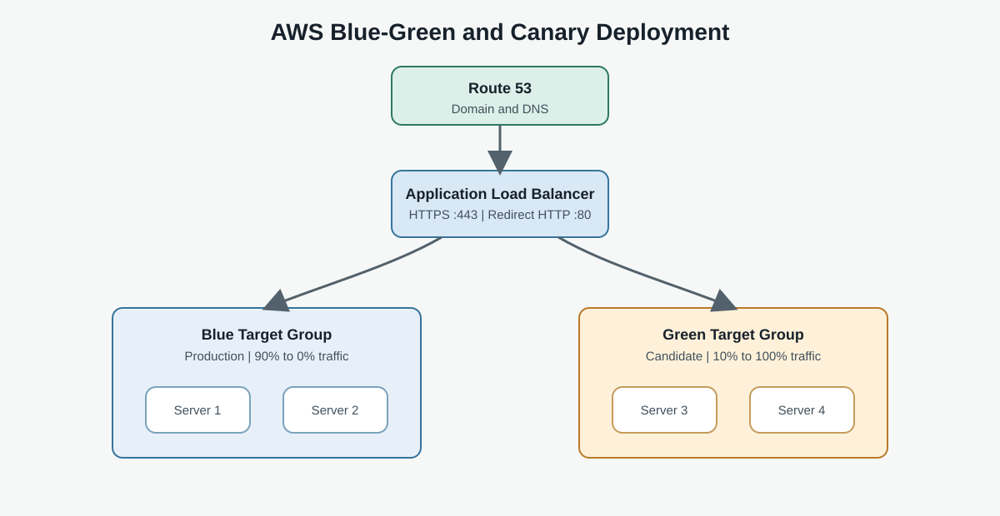

# AWS Blue-Green and Canary Deployment

An AWS deployment project that demonstrates highly available web applications behind an Application Load Balancer, with Blue-Green deployment, Canary traffic shifting, HTTPS, health checks, and rollback.

## Project Overview

The project uses four Amazon EC2 instances in two application environments:

| Environment | Servers | Application | Target group |
|---|---|---|---|
| Blue | Server 1, Server 2 | Villa Agency Website | `Blue-TG` |
| Green | Server 3, Server 4 | Klassy Cafe Website | `Green-TG` |

Blue represents the current production version. Green represents the candidate version that can be tested before receiving production traffic.

## Architecture



Traffic flows through Route 53 and HTTPS on the Application Load Balancer. The ALB routes requests to healthy targets in the Blue or Green target group.

```text
User -> Route 53 -> HTTPS ALB
                    |       |
                 Blue-TG  Green-TG
                 |   |    |    |
              Server 1  Server 2  Server 3  Server 4
```

## AWS Services

- Amazon VPC and Availability Zones
- Amazon EC2 with Apache HTTP Server
- Application Load Balancer and Target Groups
- Security Groups
- Amazon Route 53
- AWS Certificate Manager
- Internet Gateway

## Deployment Guide

Follow the guides in this order:

1. [Route 53 domain setup](setup/01-route53.md)
2. [VPC and network setup](setup/02-vpc.md)
3. [Security group configuration](setup/03-security-group.md)
4. [EC2 instance setup](setup/04-ec2.md)
5. [Target group configuration](setup/05-target-groups.md)
6. [Application Load Balancer setup](setup/06-load-balancer.md)
7. [HTTPS and ACM configuration](setup/07-https-acm.md)
8. [Blue-Green and Canary deployment](setup/08-blue-green-canary.md)
9. [Testing and validation](testing/testing.md)

## EC2 User Data

Use the matching script when launching each environment:

- [Blue server setup](user-data/blue-server.sh)
- [Green server setup](user-data/green-server.sh)

The scripts install Apache, download the selected website, copy it to `/var/www/html`, and start the web server.

## Deployment Flow

1. Prepare the VPC, subnets, route table, and security groups.
2. Launch two Blue and two Green EC2 instances using the matching user-data scripts.
3. Create target groups and register the EC2 instances.
4. Configure the ALB, listeners, health checks, and HTTPS certificate.
5. Point the Route 53 record to the ALB.
6. Test Blue and Green independently.
7. Shift traffic from Blue to Green using a full switch or staged Canary percentages such as 90/10, 50/50, and 0/100.
8. Roll back to Blue if Green fails validation or monitoring.

## Environment Details

### Blue Environment

Blue is the current production environment. It uses `Blue-TG` with Server 1 and Server 2, and serves the Villa Agency Website using [blue-server.sh](user-data/blue-server.sh).

### Green Environment

Green is the candidate environment. It uses `Green-TG` with Server 3 and Server 4, and serves the Klassy Cafe Website using [green-server.sh](user-data/green-server.sh).

## Target Groups and Health Checks

The ALB uses two target groups:

- `Blue-TG`: Server 1 and Server 2
- `Green-TG`: Server 3 and Server 4

Each target group checks the HTTP endpoint on port `80` at path `/`. Unhealthy instances are automatically removed from new traffic while healthy instances continue serving requests.

## Application Load Balancer

The ALB is the public entry point for the applications. It provides:

- Traffic distribution across healthy EC2 instances
- Separate Blue and Green target groups
- HTTP to HTTPS redirection
- HTTPS termination with an ACM certificate
- Listener rules for controlled traffic shifting

## DNS and HTTPS

Route 53 maps the project domain to the ALB using an Alias record. AWS Certificate Manager provides the public SSL/TLS certificate through DNS validation. HTTP requests on port `80` redirect to HTTPS on port `443`.

## Security Model

- The ALB security group allows inbound HTTP `80` and HTTPS `443` from the internet.
- The EC2 security group allows HTTP `80` from the ALB security group.
- SSH `22` should be allowed only from the administrator's current public IP and only when required.

This keeps the EC2 web servers behind the load balancer instead of exposing their HTTP ports directly to the internet.

## Blue-Green Deployment

1. Blue serves all production traffic.
2. Deploy the new application version to Green.
3. Test Green through its target group and instance endpoints.
4. Switch the ALB production action from `Blue-TG` to `Green-TG`.
5. Keep Blue available until Green is verified.
6. Switch traffic back to `Blue-TG` immediately if Green fails.

## Canary Deployment

Canary deployment moves traffic gradually so the new environment can be monitored at each stage:

| Stage | Blue | Green | Action |
|---|---:|---:|---|
| 1 | 90% | 10% | Monitor errors, latency, and health |
| 2 | 50% | 50% | Continue validation |
| 3 | 0% | 100% | Make Green the production environment |

At any stage, rollback means returning traffic to Blue and investigating Green before trying again.

## High Availability and Failure Handling

The four instances are distributed across multiple Availability Zones. If an instance becomes unhealthy, the ALB stops sending new requests to it and continues using the remaining healthy targets. The detailed testing guide verifies instance state, Apache, target health, HTTPS, DNS, traffic switching, rollback, and failure behavior.

## Prerequisites

- An AWS account with permissions to create the services listed above
- A domain name managed through Route 53, or a domain whose DNS can be updated
- An AWS Region with at least two Availability Zones
- An SSH key pair for EC2 access
- The public IP address used for restricted SSH access

Review the security group guide before exposing any instance to the internet. EC2 HTTP traffic should be permitted from the ALB security group, and SSH should be restricted to your IP when needed.

## Repository Structure

```text
aws-blue-green-canary-deployment/
├── README.md
├── LICENSE
├── architecture/
│   └── architecture-diagram.svg
├── setup/
│   ├── 01-route53.md
│   ├── 02-vpc.md
│   ├── 03-security-group.md
│   ├── 04-ec2.md
│   ├── 05-target-groups.md
│   ├── 06-load-balancer.md
│   ├── 07-https-acm.md
│   └── 08-blue-green-canary.md
├── testing/
│   └── testing.md
└── user-data/
    ├── blue-server.sh
    └── green-server.sh
```

## Learning Outcomes

This project covers EC2 provisioning, VPC networking, security groups, Apache, ALB routing, target health checks, DNS, ACM certificates, HTTPS, Blue-Green deployment, Canary deployment, rollback, and high availability.

## Future Improvements

- Auto Scaling Groups and Launch Templates
- CloudWatch metrics, alarms, and centralized logging
- AWS WAF and Systems Manager
- Terraform or AWS CloudFormation
- GitHub Actions and automated deployment
- Automated rollback and infrastructure testing

## Author

Vikas Jagtap | B.Sc. Computer Science | AWS and DevOps

[GitHub profile](https://github.com/vikasjagtap9696)
